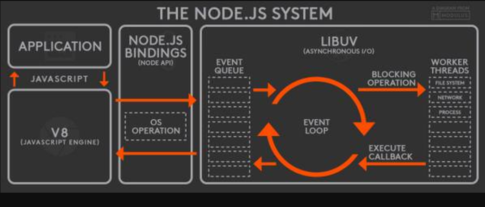

## node 基本概念

### 1、node 是什么？

node.js 是一个基于 chrome v8 引擎的 JavaScript 运行环境（runtime），node 不是一门语言，是让 js 运行在后端的运行时，
并且不包括 JavaScript 全集，因为在服务端中不包含 DOM 和 BOM，node 也提供了一些新的模块，例如：http，fs 模块等。

node.js 使用了事件驱动、非阻塞式 `I/O` 的模型，使其轻量又高效，并且 node.js 的包管理器 npm，是全球最大的开源库生态系统。

### 2、node 解决了什么问题

node 在处理高并发，`I/O` 密集场景有明显的性能优势

- 高并发：是指在同一时间并发访问服务器
- `I/O` 密集：是指文件读取、网络操作、数据库、相对的有 cpu 密集
- cpu 密集：是指逻辑处理运算、压缩、解压、加密、解密

web 主要的场景就是接收客户端的请求，读取静态资源和渲染页面，所以 node 非常适合 web 应用开发。

### 3、js 单线程

js 的主线程是单线程，在 node 中主线程依旧是单线程。

为什么不是多线程？

如果多个线程同时操作 DOM 会造成混乱。

单线程好处：

- 节约内存，并且不需要在切换执行上下文
- 不需要管锁的问题

### 4、同步异步和阻塞非阻塞

同步异步针对被调用方，这个方法会给告诉我它是同步的还是异步的。

阻塞非阻塞针对的是当前调用者的一个状态，调用这个方法，判断能不能去干别的事情。

- 同步阻塞
- 异步阻塞
- 同步非阻塞
- 异步非阻塞：我调用了一个方法，这个方法是异步的，我不需要等待这个方法执行完毕

### 5、node 中的 eventloop

